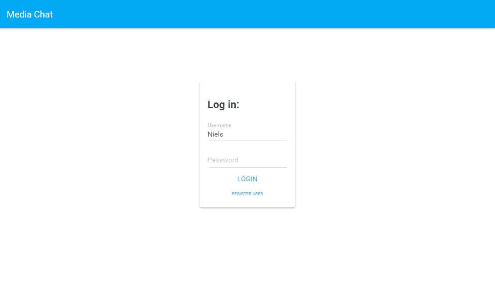
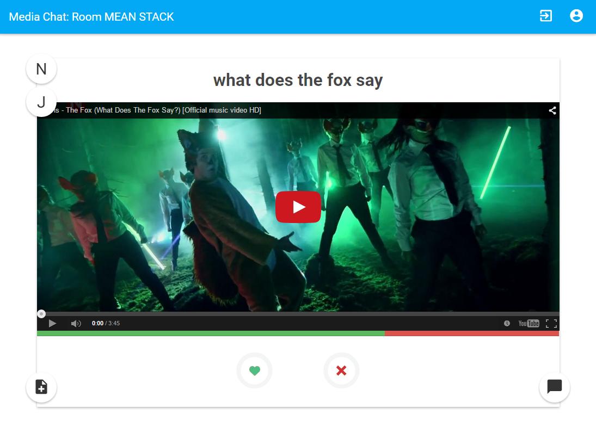

# Media chat #

Media chat app is a simple node.js application build with [AngularJS](https://angularjs.org/), [Angular Material](https://material.angularjs.org/) and [Sails](http://sailsjs.org).

With the application you can log in to a room, upload a picture, youtube video or song to the room, rate the shared content and chat.   
This application was build as a school project for the course (experimental) "Backend Development" @ [NMCT](http://nmct.be).

## Overview ##

### Login ###

To log in you have to pick a username and give in the room you want to join.   
If there is no room with the name you provide, a new one will be created.

### Room ###

In the title of the appbar and in the url, you can see in which room you are.   
If you hover over the logout action on the right, you can see as who you will logout.  

The circles on the left side are the users that are in the room.   
You can see the first letter of his or her name and when you hover over the circle, you can see the full name.

You can see the content in the middle. Every piece of content has a title and the content of course.  
You can vote yes or no by pressing the heart or the red cross beneath the content.   
The bar beneath the content represents the like versus dislikes.

To upload content, press the button on the lower left side.

### Upload Content ###

When you press the add new content button, a content picker will popup from the bottom.
You can choose between a picture, a youtube video and a sound file.

Once you have selected the type of content you want the upload, a corresponding form will popup.

### Chat ###

There is a button provided on the right lower side that shows or dismisses the chat room.
You get notified when a user joins the room, leaves the room, when a user is typing, and the message of course.

## Set-Up ##

Before running the application you must have successfully installed the following frameworks, tools.

* [Node.js](http://nodejs.org/)
* [npm](https://www.npmjs.com/)
* [Grunt](http://gruntjs.com/)
* [Bower](http://bower.io/)
* [MongoDB](http://www.mongodb.org/)
* [Sails](http://sailsjs.org)

Make sure all the command line tools are globally available in your command line.

There are two batch-files included to start the app faster.

* Run "rundb.bat" first to start the MongoDB database.
* Run "runapp.bat" after that to start the Sails application.

The app should now be running. By default it is running on port 1337.